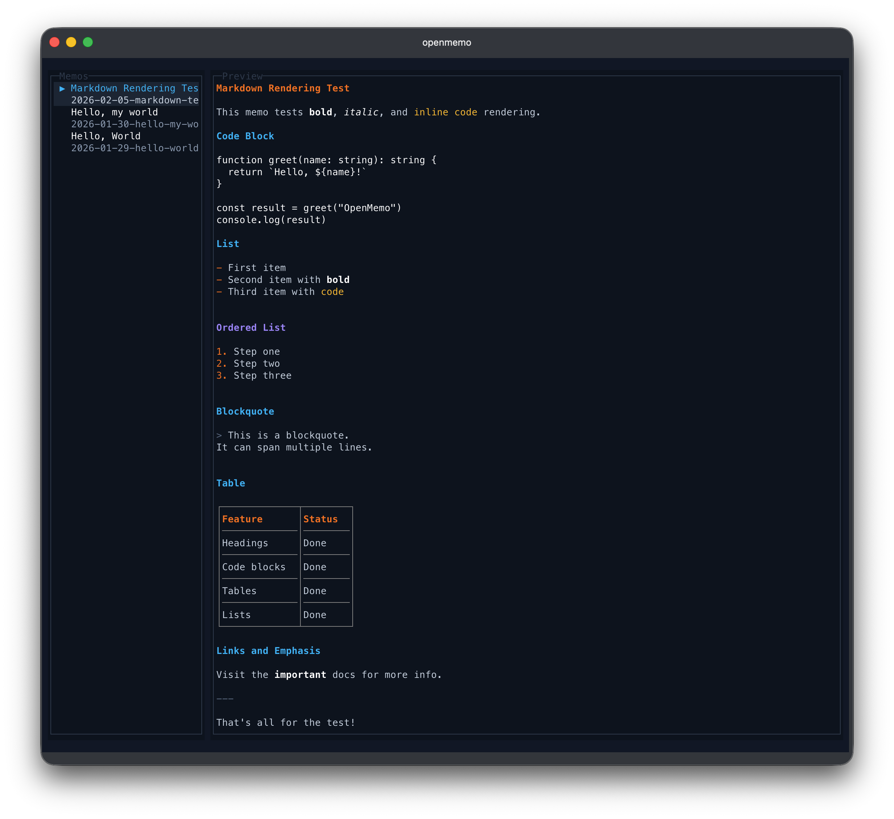

# openmemo

[](https://www.npmjs.com/package/openmemo)
[](https://github.com/arkjun/openmemo/actions/workflows/ci.yml)

[한국어](README.ko.md) | [日本語](README.ja.md)

OpenTUI-based memo app inspired by [mattn/memo](https://github.com/mattn/memo).



### Features
- Terminal UI for browsing and opening memos
- Markdown preview with syntax highlighting (headings, code blocks, bold, italic, links)
- Create, list, edit, delete, grep, and cat commands
- Markdown storage with lightweight frontmatter (title, date, tags)
- Uses your preferred editor via environment variables

### Installation

```bash
npm install -g openmemo
```

Or with other package managers:
```bash
pnpm add -g openmemo
yarn global add openmemo
```

### Usage
Launch the TUI:
```bash
openmemo
```

Create a memo:
```bash
openmemo new
```

Other commands:
```bash
openmemo list
openmemo edit <query>
openmemo delete <query>
openmemo grep <pattern>
openmemo cat <query>
openmemo help
```

Notes:
- `<query>` matches the memo id or title (partial match). If multiple match, you will be prompted to select.
- `grep` uses a case-insensitive JavaScript regex when the pattern is valid; otherwise it falls back to a case-insensitive substring search.
- TUI: press `q` or `Esc` to quit.

### Configuration
Environment variables:
- `OPEN_MEMO_DIR`: override memo storage directory
- `OPEN_MEMO_EDITOR`: preferred editor command
- `VISUAL` / `EDITOR`: fallbacks if `OPEN_MEMO_EDITOR` is not set

Editor resolution order:
1. `OPEN_MEMO_EDITOR`
2. `VISUAL`
3. `EDITOR`
4. `vi`

### Data Storage
Default directory:
```
~/.openmemo/memos
```

File naming format:
```
YYYY-MM-DD-<slug>.md
```

Template content:
```markdown
---
title: Your Title
date: 2026-01-30 12:34
tags: tag1, tag2
---

# Your Title
```

### Contributing

```bash
git clone https://github.com/arkjun/openmemo
cd openmemo
pnpm install
pnpm dev              # Run from source
pnpm build            # Build TypeScript
pnpm build:binaries   # Build platform binaries (requires Bun)
pnpm test             # Run tests (watch mode)
pnpm test:run         # Run tests once
pnpm test:coverage    # Coverage report
```
